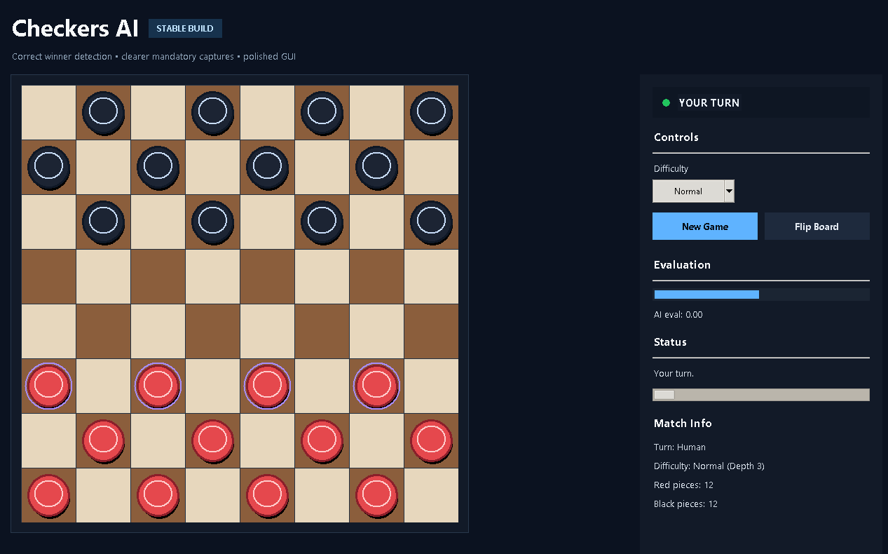

## 👤 Author
This project was developed and owned by **souror**.

All rights reserved. Unauthorized copying or use is prohibited.

---

# 👋 Introducing Myself
Hello! I'm a beginner programmer, and this is my first complete project.  
I built this Checkers game to practice Python, game logic, and basic AI development.

I'm continuously learning and improving, and this project represents an important step in my journey.

---

# ♟️ CrownMind CzechPy
> A smart AI opponent that thinks ahead and plays strategically.
A powerful Checkers AI built with Minimax and Alpha-Beta pruning in Python.

This project features a clean graphical interface, intelligent AI with multiple difficulty levels, and a smooth gameplay experience designed for both beginners and advanced players.

---

## 🚀 Features

- Full checkers gameplay on an 8×8 board
- Human vs AI mode
- Multiple difficulty levels:
  - Beginner
  - Easy
  - Normal
  - Hard
  - Expert
- Mandatory capture enforcement
- Multi-jump capture support
- King promotion for both sides
- Turn tracking and game-over detection
- Move highlighting and visual feedback
- Board flip option for better viewing
- Evaluation bar showing AI advantage
- Modern Tkinter interface

---

## ▶️ How to Run

### Option 1: Run the EXE file
If you downloaded the compiled version, simply open the `.exe` file.

### Option 2: Run from Python source

    python project_of_the_year.py

Make sure Python is installed on your system.

---

## 📦 Requirements

- Python 3.x  
- tkinter (included with Python)  
- No external libraries required  

---

## 🎮 Gameplay Rules

- Red is the human player  
- Black is controlled by the AI  
- Captures are mandatory  
- Pieces move diagonally  
- Normal pieces move forward only  
- Kings move in all diagonal directions  
- Promotion occurs at the opposite end  

---

## 🧠 AI Difficulty Levels

- Beginner → Weak / random  
- Easy → Simple logic  
- Normal → Balanced  
- Hard → Strategic  
- Expert → Best possible moves  

The AI uses Minimax with Alpha-Beta pruning for efficient decision making.

---

## 📂 Project Structure

    Checker Game/
    ├── project_of_the_year.py
    ├── README.md
    └── (optional build files or exe)

---

## 📝 Notes

- Designed to be stable, playable, and visually clear  
- Includes move highlighting and game-over detection  
- EXE version is ready for Windows use  

---

## 📸 Screenshots

  

---

## 🔮 Future Improvements

- Add sound effects  
- Improve AI performance  
- Add multiplayer mode  
- Enhance UI/UX  

---

## 👨‍💻 Author

Created by **[souror07]**

---

## 📜 License

Copyright (c) 2026 souror

All rights reserved.

Permission is NOT granted to any person to use, copy, modify, merge, publish, distribute, sublicense, or sell this software or any part of it.

This project and its source code are the exclusive property of the author (souror).  
Any unauthorized use, reproduction, or distribution of this project is strictly prohibited.

THE SOFTWARE IS PROVIDED "AS IS", WITHOUT WARRANTY OF ANY KIND, EXPRESS OR IMPLIED.

For any permission requests, contact the author.
